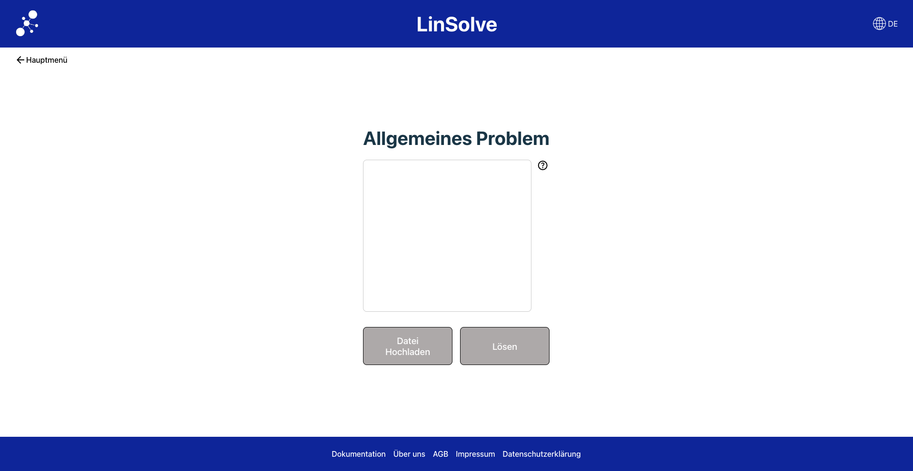

# Linsolve


## Table of Contents
1. [General Information ](#general-information)
2. [Dependencies](#Dependencies)
3. [Getting Started](#getting-started)
4. [Collaboration](#Collaboration)
5. [License](#License)
6. [FAQs](#faqs)

## General Information
***
This project was developed as part of a programming project in the dual degree programme in Business Informatics at Osnabrück University of Applied Sciences. The aim of the project is to develop a website that serves as an interface for the **Highs** and **GLPK** solvers for linear optimisation problems. 

You can access the website at: [https://jonahesselmann.github.io/linsolve/](https://jonahesselmann.github.io/linsolve/).


## Screenshot

### Landing Page

On this page, the user can select the type of problem they want to solve and upload a file containing the problem.

### General Problem Page

On this page, the user can specify the general problem they want to solve. This needs to be done using **GMPL**.

### Specific Problem Page

On this page, specific problems can be detailed and defined.


# Dependencies
*************
A list of technologies used within the project:
* [Vue](https://vuejs.org/): version ^3.4.37
* [Vue-i18n](https://vue-i18n.intlify.dev/): version ^9.14.0
* [Vue-router](https://router.vuejs.org/): version ^4.0.13
* [Pinia](https://pinia.vuejs.org/): version ^2.2.2

# Getting Started
## Prerequisities
Make sure the following software is installed on your system:
* npm (usually comes with Node.js)


## Installation
Open your terminal and run the following command to clone the repository to your local machine:
1. git clone https://github.com/JonaHesselmann/linsolve.git

2. change into the Project directory.
To install all the necessary dependencies for the project, run the following command: 
```bash
npm install
```
3. Once the dependencies are installed successfully, you want to build the project for production, you can run the following command: 
```bash
npm run build
npm run preview
```

## Testing
* Testing done Via Vitest unit tests
* to run the tests use:
```bash
vitest
```
Or alternatively use:
```bash
npm test dev
```
Test Coverage 
```bash 
npm test dev --coverage
```

## Collaboration

We are always looking for contributors and collaborators to help improve this project! Whether you’re a developer, designer, mathematician, or simply passionate about problem-solving, there are many ways you can get involved.

### How You Can Contribute

- **Feature Development**: Help us build new features or improve existing ones.
- **Bug Fixing**: Found a bug? Submit an issue or, even better, a pull request with a fix!
- **Documentation**: We’re always looking to improve our documentation. Whether it's clarifying explanations, adding examples, or making the project easier to use, your input is welcome.
- **Feedback**: Share your thoughts and suggestions for improving the user experience, feature requests, or general improvements.
- **Testing**: Help us test new features, report bugs, and ensure the project is stable across different environments.

## License 
This project is licensed under the GNU General Public License v3.0.

## Documentation
Currently, the button on the website to open the documentation is not yet functional. Therefore, we have decided to temporarily publish the documentation in the Wiki on GitHub. You can access all relevant information and guides there.


**********
# FAQs
**********

### 1. What format should my problem file be in?
The file should be in **LP** (Linear Programming) or **GMPL** (GNU Math Programming Language) format.

### 2. Which solvers are implemented?
For general problems, the **GMPL** solver is implemented using a WebWorker. For specific problems, **Highs** is implemented with WebAssembly.

### 3. What is GMPL?
**GMPL** (GNU Math Programming Language) is a high-level modeling language used for describing linear, nonlinear, and mixed-integer programming problems. It is part of the **GLPK** (GNU Linear Programming Kit) and is widely used for optimization problems.

### 4. Who can I contact if I encounter an issue or have a question?
If you run into any issues or have questions, feel free to open an issue on the GitHub repository, or reach out to the project maintainers. We’re happy to help!

### 5. What is Linsolve?
Linsolve is a web-based interface for the Highs Solver, designed to solve linear optimization problems. The project was developed as part of a programming project in the Business Informatics program at Osnabrück University of Applied Sciences.

### 6. How can I submit a problem to be solved?
You can submit a problem by selecting the appropriate problem type on the **Landing Page** and uploading the problem file. The system supports both general and specific problem types.

### 7. How can I run the project locally?
To run the project locally, clone the repository, install the required dependencies using `npm install`, and then run `npm run build` to start. Detailed instructions can be found in the [Getting Started](#getting-started) section.

### 8. How is the project tested?
The project uses **Vitest** for unit testing. You can run the tests using the command `vitest` or `npm test dev`. Test coverage reports can also be generated.

### 9. Can I contribute to this project?
Absolutely! We welcome contributions from developers, designers, and problem-solvers. Please see the [Collaboration](#collaboration) section for more details on how to get involved.


### 11. What are the main dependencies of this project?
The project uses several technologies, including:
- **Vue.js** for the frontend
- **Vue Router** for navigation
- **Pinia** for state management


You can find a full list of dependencies in the [Dependencies](#dependencies) section.

**********
## Acknowledgments
We would like to thank all contributors and the faculty at Osnabrück University of Applied Sciences for their guidance and support during this project.
**********

